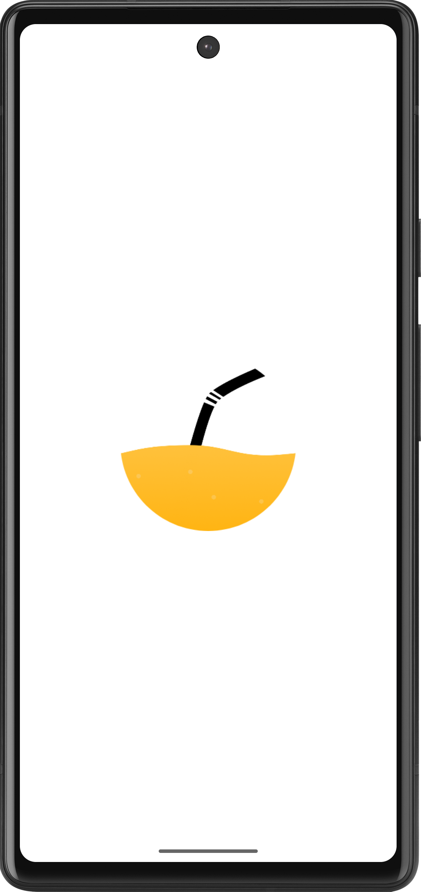
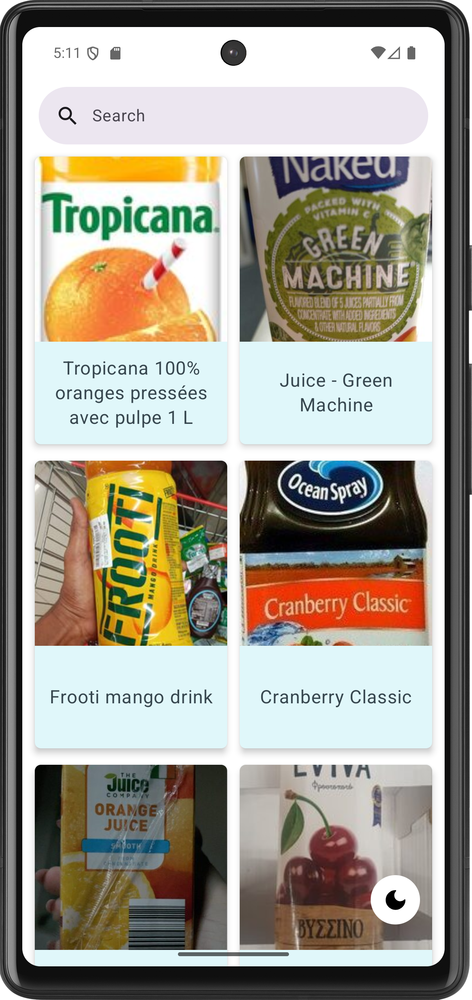
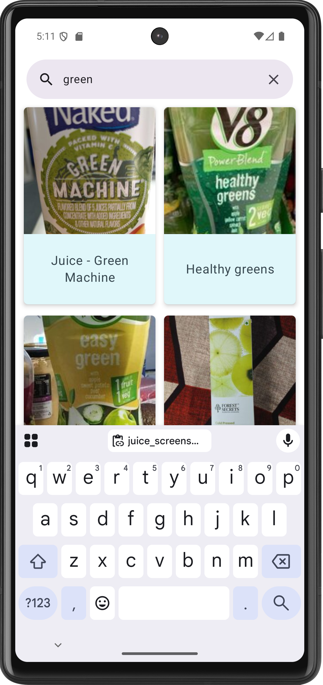
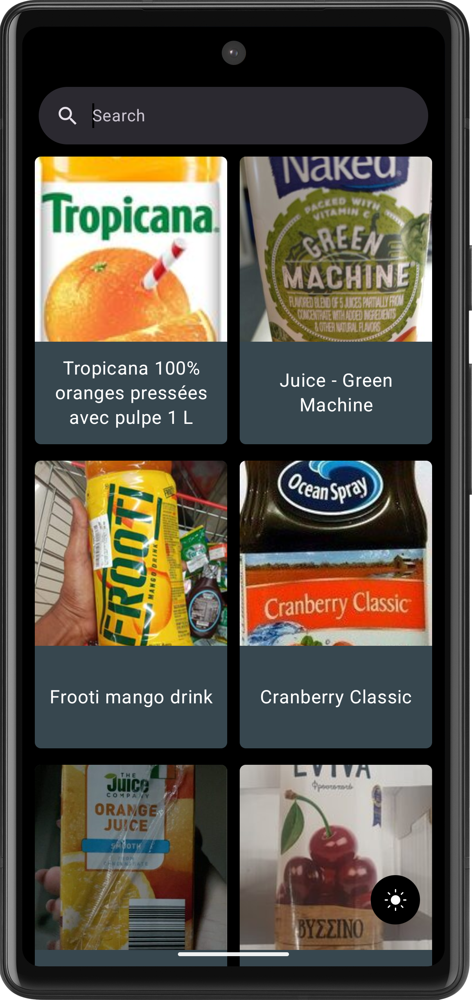

# 🧃 Juice App

A modern Android application that displays a list of juices and allows searching through them. Built with [Jetpack Compose](https://developer.android.com/jetpack/compose), [Paging 3](https://developer.android.com/topic/libraries/architecture/paging/v3-overview), and [Retrofit](https://square.github.io/retrofit/), following **Clean Architecture** principles.

---

## 🖼️ Screenshots

 &nbsp;&nbsp;&nbsp; 
 &nbsp;&nbsp;&nbsp; 
 &nbsp;&nbsp;&nbsp; 


---

## ✨ Features

- 🔍 Search functionality with a `SearchBar`
- ♻️ Efficient list loading using `Paging 3`
- 🌙 Light/Dark theme toggle
- 💾 Persistent theme preference using `DataStore`
- 📶 REST API integration using Retrofit
- ✅ Unit testing

---

## 🧑‍💻 Tech Stack

- **Language:** Kotlin
- **UI:** Jetpack Compose
- **Architecture:** Clean Architecture + MVVM + Hilt
- **Networking:** Retrofit + OkHttp
- **Pagination:** Paging 3
- **Persistence:** DataStore (Preferences)
- **Image Loading:** Coil
- **Testing:** JUnit, Truth, Coroutine Test, Mockito, MockWebServer

---

## 🚀 Getting Started

1. Clone the repo:
   ```bash
   git clone https://github.com/NabilBasriH/juice-app.git
2. Open in Android Studio
3. Build and Run on an emulator or device
